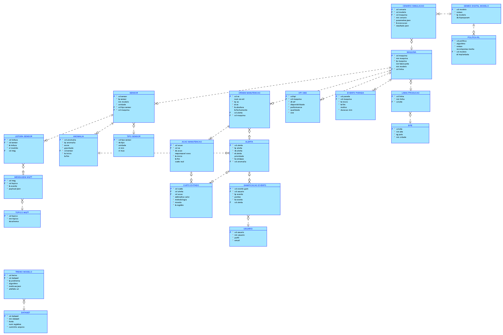
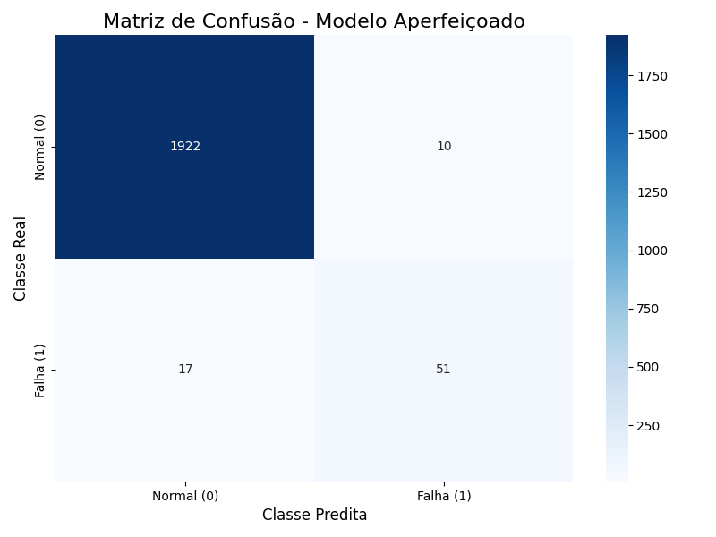

# FIAP - Faculdade de Informática e Administração Paulista

<p align="center">
<a href= "https://www.fiap.com.br/"></a>
</p>

# PreventAI - Solução Inteligente para Prevenção de Falhas em Linhas de Produção Industrial

## Equipe Rocket

## 👨‍🎓 Integrantes:


## 📜 Descrição

Este projeto, desenvolvido para o desafio da **Hermes Reply**, consiste em um MVP (Mínimo Produto Viável) de uma solução de manutenção preditiva para a Indústria 4.0. O sistema integra um pipeline de dados fim-a-fim, desde a coleta de dados de sensores (simulados) até a visualização de KPIs e alertas em um dashboard interativo.

A solução utiliza um banco de dados PostgreSQL para persistência, um modelo de Machine Learning (`RandomForestClassifier`) para detecção de anomalias e um dashboard em Streamlit para monitoramento, demonstrando um fluxo de dados coeso e funcional.

## 🎯 Objetivos do MVP

- **Integrar** os componentes das entregas anteriores (arquitetura, coleta, banco de dados e ML) em um fluxo fim-a-fim.
- **Demonstrar** a coleta, ingestão, armazenamento e análise de dados de forma coesa.
- **Visualizar** KPIs operacionais e resultados do modelo de ML em um dashboard.
- **Implementar** um sistema de alerta simples baseado em thresholds.

## 🧱 Arquitetura da Solução


_Figura: Arquitetura do pipeline de dados, da coleta à visualização._

## 🧰 Tecnologias Utilizadas

- **Linguagens:** `Python 3.10`
- **Análise e ML:** `Pandas`, `Scikit-learn`, `Matplotlib`
- **IoT e Sensoriamento (Simulado):** `ESP32`, `Wokwi`, `PlatformIO`
- **Banco de Dados:** `PostgreSQL` (com `psycopg2-binary`)
- **Visualização e Dashboard:** `Streamlit`
- **Orquestração e Deploy (Visão):** `Docker`, `Apache Airflow`

## ⚙️ Como Executar o MVP

Para executar o projeto e ver o pipeline em ação, siga os passos abaixo na ordem correta:

1.  **Configurar o Ambiente**:
    -   Clone este repositório.
    -   Crie um arquivo `.env` na raiz do projeto com as credenciais do seu banco de dados PostgreSQL (recomenda-se usar o **Neon** para facilitar). Use o exemplo abaixo:
    ```
    # .env
    DB_NAME="seu_banco"
    DB_USER="seu_usuario"
    DB_PASS="sua_senha"
    DB_HOST="seu_host"
    DB_PORT="5432"
    ```
    -   Instale as dependências: `pip install -r requirements.txt`.

2.  **Criar as Tabelas no Banco**:
    -   Execute o conteúdo do script `scripts/preventAI.sql` no seu cliente PostgreSQL (como DBeaver ou o **SQL Editor** do Neon) para criar a estrutura de tabelas.

3.  **Carregar os Dados Históricos**:
    -   Execute o script para popular o banco com o dataset inicial.
    ```bash
    python db/load_data.py
    ```

4.  **Treinar o Modelo de ML**:
    -   Execute o pipeline de treino para gerar a matriz de confusão que será exibida no dashboard.
    ```bash
    python ml/ml_pipeline.py
    ```

5.  **Iniciar o Dashboard e a Simulação**:
    -   Em um terminal, inicie o dashboard:
    ```bash
    streamlit run dashboard/app.py
    ```
    -   (Opcional) Em **outro terminal**, inicie a ingestão de dados em tempo real para ver os KPIs se atualizando (requer atualização manual da página do dashboard):
    ```bash
    python ingest/simulate_data.py
    ```

## 🎥 Vídeo de Demonstração

Um vídeo de 5 minutos foi gravado para demonstrar o projeto fim-a-fim, explicando a arquitetura, o fluxo de dados e os resultados.

**[▶️ Assista ao vídeo de demonstração no YouTube](https://youtu.be/b8reOYEs680)**

---

## 📚 Histórico de Desenvolvimento (Entregas Anteriores)

Esta seção detalha o trabalho realizado nas sprints anteriores, que culminaram no MVP final.

### 🎯 Visão de Longo Prazo do Projeto

A visão completa do PreventAI inclui o desenvolvimento de um **Gêmeo Digital Executável (xDT)**, uma réplica virtual dos ativos industriais que permite simulações dinâmicas, geração de cenários com IA generativa e aprendizado autônomo para otimização de processos. A solução também prevê autonomia proativa com **Aprendizado por Reforço (RL)** e um sistema de **gamificação** para engajar os operadores.

### 🗄️ Entrega 1: Modelagem do Banco de Dados

O projeto iniciou com a modelagem de um banco de dados relacional no **Oracle SQL Developer Data Modeler**. O modelo foi projetado para ser escalável e suportar todas as funcionalidades da visão de longo prazo.

**Diagrama Entidade-Relacionamento (DER):**


_Figura: DER exportado da ferramenta._

**Principais Entidades:**

- **Estrutura:** `SITE`, `LINHA_PRODUCAO`, `MAQUINA`, `SENSOR`.
- **Telemetria:** `LEITURA_SENSOR`, `MENSAGEM_MQTT`.
- **Análise e Manutenção:** `ANOMALIA`, `ALERTA`, `ORDEM_MANUTENCAO`.
- **KPIs e Finanças:** `KPI_OEE`, `CUSTO_EVIDADO`.
- **IA e Simulação:** `GEMEO_DIGITAL_MODELO`, `TREINO_MODELO`.

----
> O script SQL de criação (`DDL`) está em `scripts/preventAI.sql`.

### 📡 Entrega 2: Estratégia de Coleta de Dados com ESP32

A estratégia de coleta foi validada com um **ESP32**, primeiramente em ambiente simulado (`Wokwi`) e depois com um template para sensores reais e comunicação via `MQTT`.

----
**Simulação via Wokwi:**


_Figura: Circuito simulado no Wokwi com sensores virtuais e display LCD._

**Análise Exploratória:**

Utilizamos o dataset `predictive_maintenance.csv` para realizar uma análise exploratória e gerar visualizações iniciais, como a relação entre temperatura e tempo de uso da ferramenta.

> O código do ESP32 está na pasta `src/esp32`.

### 🤖 Entrega 3: Pipeline de Machine Learning

Implementamos um pipeline em `Python/Scikit-learn` para classificar o estado da máquina em **Normal (0)** ou **Falha (1)**.

**Modelo:** `RandomForestClassifier` com 100 árvores.

**Resultados (Após Otimização):**


_Figura: Matriz de confusão do modelo no conjunto de teste._

- **Acurácia:** 99%
- **Recall (classe Falha):** 75%

**Leitura executiva:** O modelo inicial apresentava um bom desempenho geral, mas um Recall de 63% para a classe "Falha" era um risco de negócio. Após a aplicação de **Engenharia de Atributos** (criação das features `Power` e `TempDiff`) e o tratamento do **desbalanceamento de classes** (`class_weight='balanced'`), o **Recall aumentou para 75%**. Essa otimização torna o modelo muito mais eficaz em seu objetivo principal: detectar o máximo de falhas possível, mesmo que isso aumente ligeiramente os falsos alarmes.

## 💡 Decisões Técnicas

- **Banco de Dados na Nuvem (Neon):** Optamos pelo Neon (PostgreSQL Serverless) para eliminar a necessidade de instalação local, simplificar o setup e garantir um ambiente de banco de dados profissional e escalável.
- **Otimização do Modelo de ML:** O foco na métrica de **Recall** durante a otimização com `GridSearchCV` foi uma decisão de negócio para minimizar o risco de falhas não detectadas, que são mais custosas do que falsos positivos.
- **Engenharia de Atributos:** A criação de novas features (`Power` e `TempDiff`) foi fundamental para fornecer mais contexto ao modelo e melhorar sua capacidade de encontrar padrões complexos, resultando em um aumento significativo no desempenho.
- **Dashboard (Streamlit):** A escolha do Streamlit permitiu o desenvolvimento rápido de um dashboard interativo para visualização de KPIs e resultados, conectando-se diretamente ao banco de dados para exibir dados em tempo real (simulado).

> O código do pipeline está em `ml/ml_pipeline.py`.

---

## 👥 Divisão de Responsabilidades

| Integrante                   | Responsabilidade Principal                                      |
| ---------------------------- | --------------------------------------------------------------- |
| Jonas Luis da Silva          | Estruturação do repositório e documentação base.                |
| Renan Francisco de Paula     | Simulação de sensores e envio de dados via MQTT.                |
| João Vitor Severo Oliveira   | Levantamento técnico dos sensores.                              |
| Isabelle Gomes Ferreira      | Criação da arquitetura visual e pipeline de dados.              |
| Edson Henrique Felix Batista | Redação técnica da proposta e conceito do Gêmeo Digital.        |

----
----
----
----
----
----
----
----
----
----
----
----
----
----
| João Vitor Severo Oliveira   | Levantamento técnico e escolha dos sensores reais compatíveis com ESP32                                                        |
| Isabelle Gomes Ferreira      | Criação da arquitetura visual no diagrams.net e estruturação do pipeline de dados                                              |
| Edson Henrique Felix Batista | Responsável pela redação técnica da proposta, com foco em coleta de dados, tecnologias empregadas e o Gêmeo Digital Executável |

## 📁 Estrutura de Pastas

----
----
- **/assets**: Imagens, logos e recursos visuais.
- **/dashboard**: Código-fonte do dashboard em Streamlit.
- **/db**: Scripts para carga de dados no banco.
- **/document**: Documentação técnica, DER e relatórios.
- **/ingest**: Scripts para ingestão e simulação de dados.
- **/ml**: Notebooks e scripts do pipeline de Machine Learning.
- **/scripts**: Scripts SQL para criação do banco (DDL).
- **/src**: Código-fonte do ESP32.